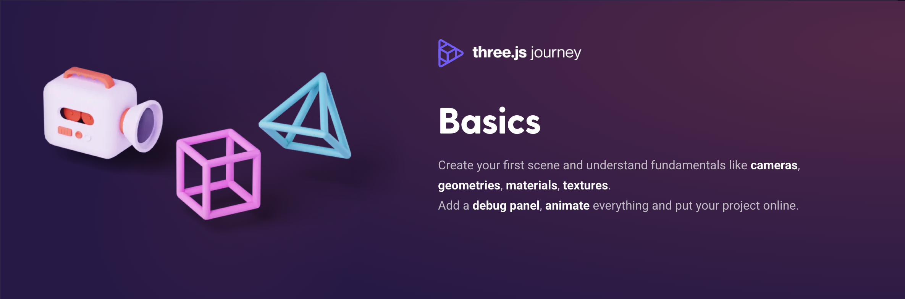
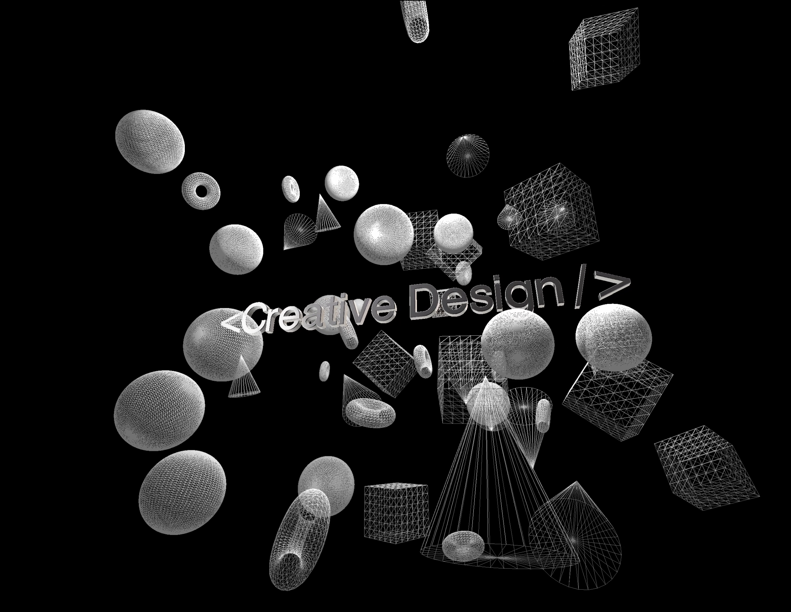

# Three.js – Basics
Three.js Journey by Bruno Simon [@brunosimon](https://github.com/brunosimon/) is a comprehensive, hands-on course designed to teach 3D web development using Three.js. It covers everything from basic transformations and animations to advanced rendering, shaders, physics, and real-time interactions.



📚 More details: https://threejs-journey.com/


## Lessons Learned
- Transform Objects – Position, rotation, and scaling in 3D space.
- Animations – Using requestAnimationFrame and GSAP for smooth motion.
- Cameras – Exploring perspective vs. orthographic cameras and how to position them for the best viewing experience.
- Fullscreen & Resizing – Ensure the scene is responsive across different screen sizes.
- Geometries – Working with built-in primitives like boxes, spheres, and toruses.
- Debug UI – Adding dat.GUI to tweak values dynamically.
- Textures – Applying images to objects, handling UV mapping, and optimizing textures.
- Materials – Exploring basic, standard, and physically based (PBR) materials for realistic rendering.
- 3D Text – The highlight of my project! Using THREE.TextGeometry creates and customizes 3D typography, adding lighting, shadows, and a smooth interactive feel.

## Final result


## Installation

Install project with npm
```bash
  npm install 
  npm run dev
```